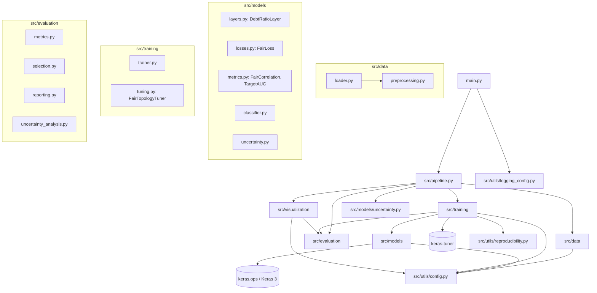
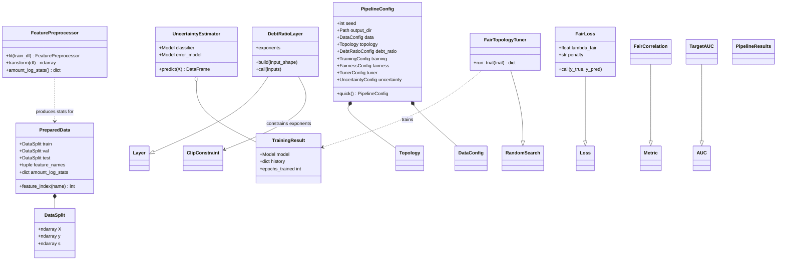

# Architecture

## 1. Project overview

The project trains a neural credit-default classifier on the *Home Credit
Default Risk* dataset that is **accurate**, **fair** and **honest about its
confidence**. A custom Keras layer computes saturated debt ratios inside
the network. A FAIR loss penalises the correlation between the predicted
probability and gender. Keras Tuner searches the topology and the fairness
weight λ. Finally, two estimators quantify uncertainty: an auxiliary
error-predictor network and MC-dropout variance.

## 2. Module dependency diagram



## 3. Data flow

```mermaid
flowchart LR
    RAW[(application_train<br/>.csv / .zip)] --> CLEAN[clean_raw_data<br/>gender M=0/F=1, age, log1p amounts,<br/>EXT_SOURCE missing flags]
    CLEAN --> SPLIT[stratified split<br/>80 / 10 / 10]
    SPLIT --> PRE[FeaturePreprocessor<br/>median impute + z-score<br/>fitted on TRAIN only]
    PRE --> SWEEP[λ sweep<br/>default topology]
    PRE --> TUNER[Keras Tuner<br/>topology + λ<br/>objective: AUC − |corr|]
    SWEEP --> CAND[candidates<br/>validation metrics]
    TUNER --> CAND
    CAND --> PARETO[[pareto_fairness.png]]
    CAND --> SELECT[select_best_fair<br/>max val AUC s.t. val |corr| ≤ 0.05]
    SELECT --> FINAL[final Base λ=0 and FAIR λ*<br/>same topology]
    FINAL --> TEST[[base_vs_fair_test.md/.csv<br/>TEST evaluated once]]
    FINAL --> LOSS[[loss_curves.png]]
    FINAL --> ERR[error model<br/>learns abs y − p̂]
    FINAL --> MC[MC dropout<br/>T stochastic passes]
    ERR --> UEST[UncertaintyEstimator.predict<br/>class + expected error + variance]
    MC --> UEST
    UEST --> UPLOTS[[uncertainty_by_class.png<br/>uncertainty_by_missing_ext_sources.png<br/>error_model_calibration.png]]
```

## 4. Class diagram



## 5. Key design decisions

| Decision | Reason |
|---|---|
| Sensitive attribute kept as an input feature | "Fairness through unawareness" fails because proxies leak gender (stressed in class); the FAIR loss neutralises its influence explicitly. |
| Gender passed to the loss as the 2nd label column | Keras losses only receive `(y_true, y_pred)`; this is the approach shown in class. |
| `corr²` penalty by default (`abs` available) | Professor's choice; smooth at 0, unlike `|corr|`. |
| Pearson computed on flattened tensors | Avoids the `(N,)` vs `(N,1)` broadcasting bug discussed in the correction lecture. |
| Early stopping on `val_loss` | This is the objective being optimised, penalty included (the old code used `val_auc`, which ignores fairness). |
| Model selection on validation, test used once | Avoids test-set leakage in choosing the "best FAIR" model. |
| Base and FAIR share the selected topology | Only λ differs, so the comparison measures the cost of fairness alone. |
| Keras Tuner objective `val_auc − w·val_|corr|` | With AUC alone, the search collapses to λ → 0. |
| Minimum dropout 0.1 in the search space | MC-dropout variance needs active dropout layers. |

## 6. How to run

```bash
python -m venv .venv
.venv\Scripts\activate            # Windows  (Linux/macOS: source .venv/bin/activate)
pip install -r requirements.txt
python main.py                    # full experiment, writes outputs/
python -m pytest                  # 37 tests (unit + end-to-end)
```

`python main.py --quick` runs the same pipeline on a 6 000-row sample in
about 2 minutes (smoke test).
